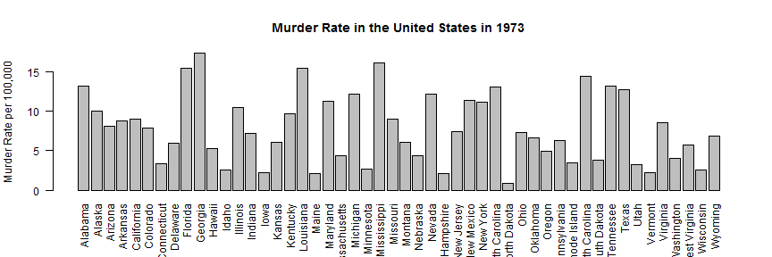
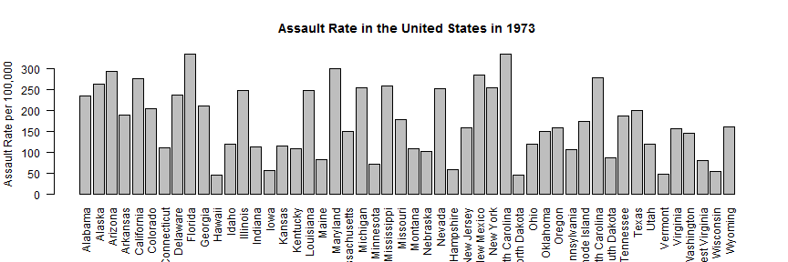
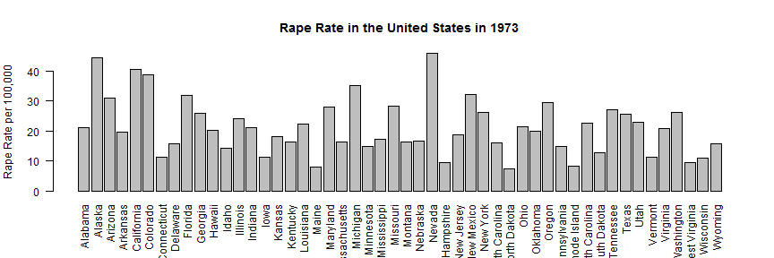

## Introduction

For this app, I have used the [USArrests dataset] (https://stat.ethz.ch/R-manual/R-devel/library/datasets/html/USArrests.html), which comes with R datasets package. This dataset contains arrest statistics for assault, murder, and rape in each of the 50 US states in 1973 and the percentage of the population living in urban areas. The structure of the dataset is as follows:
- Murder: number of murder arrests (per 100,000 residents)
- Assault: number of assault arrests (per 100,000 residents)
- UrbanPop: percentage of urban population
- Rape: number of rape arrests (per 100,000 residents) 

An intuitive way to visualize the data is to through an interactive map (choropleth). To use the app, select the violent crime type from the dropdown box to display the crime rate for each state as indicated by the color code. The map uses a color legend that reflects the severity of violent crime rate for each state, where blue indicates low crime rate and red indicates high crime rate. The average & standard deviation is also computed and displayed. If you hover your mouse pointer over a state, the number of arrests will be displayed.<br /><br />

--- .class #id 

## Bar Graph of Murder Rates

Let's look at the murder rate for each of the states using a simple bar graph. 

```r
state.names = row.names(USArrests)
barplot(USArrests$Murder, names.arg = state.names, las = 2, ylab = "Murder Rate per 100,000", 
    main = "Murder Rate in the United States in 1973")
```



--- .class #id 

## Bar Graph of Assault Rates

Let's look at the assault rate for each of the states using a simple bar graph. 

```r
state.names = row.names(USArrests)
barplot(USArrests$Assault, names.arg = state.names, las = 2, ylab = "Assault Rate per 100,000", 
    main = "Assault Rate in the United States in 1973")
```



--- .class #id 

## Bar Graph of Rape Rates

Let's look at the rape rate for each of the states using a simple bar graph. 

```r
state.names = row.names(USArrests)
barplot(USArrests$Rape, names.arg = state.names, las = 2, ylab = "Rape Rate per 100,000", 
    main = "Rape Rate in the United States in 1973")
```



--- .class #id 

## Credits

This presentation and application are developed as part of the [Developing Data Products] (https://www.coursera.org/course/devdataprod) course.

The app is located at [https://limminchim.shinyapps.io/PA91](https://limminchim.shinyapps.io/PA91).

The code for this presentation & shiny app can be found at [Github Repository](https://github.com/limminchim/PA91).

I would like to give due credit to https://lenwood.shinyapps.io/USArrests/ from which I based my app.


